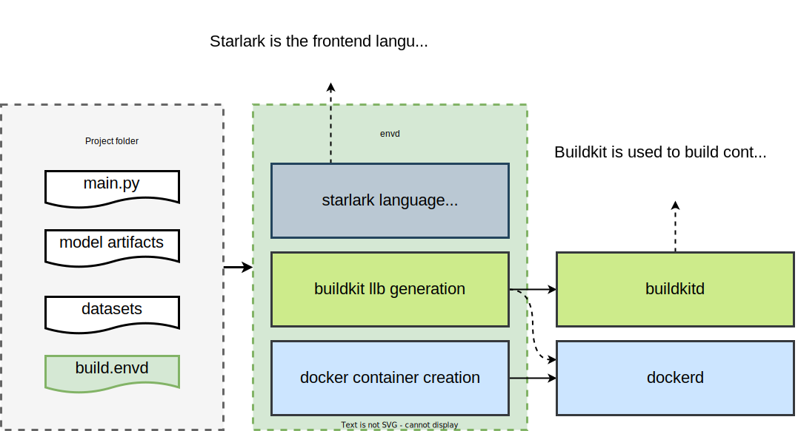

# 开发教程

首先感谢你愿意为 `envd` 添砖加瓦 🌟!

我们的社区欢迎各种形式的贡献并且希望能尽我们所能地去拓展“贡献者”这个词的含义。我们的 [贡献指南](community/contributing) 包含一些可以参与到项目其中的其他方式。如果你想向项目贡献代码，那么下面包含一些基础的步骤。

## 代码库结构

`envd` 的源代码托管在 [github.com/tensorchord/envd](https://github.com/tensorchord/envd)。除此之外，项目文档的源代码托管在 [github.com/tensorchord/envd-docs](https://github.com/tensorchord/envd-docs)。

项目的代码库中有很多文件，下面是一个简短的概括。这些文件（夹）看起来很难懂，但你不需要了解代码库每一个文件的作用。我们推荐先从一个模块开始学习（比如，在 `envd` 中添加一个新的函数），然后慢慢地去了解其他部分。

- [📁 base-images/](https://github.com/tensorchord/envd/tree/main/base-images) 包含 Dockerfiles 和 `envd` 基础镜像的建造脚本。
- [📁 cmd/](https://github.com/tensorchord/envd/tree/main/cmd) 包含 `envd` 和 `envd-sshd` 的命令行界面代码
    - [📁 envd/](https://github.com/tensorchord/envd/tree/main/cmd/envd) `envd` 的命令行界面
    - [📁 envd-sshd/](https://github.com/tensorchord/envd/tree/main/cmd/envd-sshd) `envd-sshd` 的命令行界面，`envd` 用户不会直接使用它。它会注入到运行环境来设置 sshd
- [📁 docs/](https://github.com/tensorchord/envd/tree/main/docs) 并不包含文档！它包含 `README.md` 中的提议和静态资源。项目文档托管在 [github.com/tensorchord/envd-docs](https://github.com/tensorchord/envd-docs)。
- [📁 envd/](https://github.com/tensorchord/envd/tree/main/envd) 包含一个用来生成 API 引用的假 python 包。你只需要在对 `envd` API 做出修改时才需要对这个部分做出改动。
- [📁 examples/](https://github.com/tensorchord/envd/tree/main/examples) 包含 `envd` 的一些示例代码。
- [📁 pkg/](https://github.com/tensorchord/envd/tree/main/pkg) 包含 `envd` 命令行界面的代码实现。
    - [📁 app/](https://github.com/tensorchord/envd/tree/main/pkg/app) 包含命令行界面的配置。
    - [📁 autocomplete/](https://github.com/tensorchord/envd/tree/main/pkg/autocomplete) 包含 bash 和 zsh 的自动补全代码。
    - [📁 builder/](https://github.com/tensorchord/envd/tree/main/pkg/builder) 包含 buildkit 的建造器，它是项目中非常重要的一个部分。建造器会将 starlark 编译成 [buildkit LLB](https://github.com/moby/buildkit#exploring-llb)，然后再构造镜像。
    - [📁 buildkitd/](https://github.com/tensorchord/envd/tree/main/pkg/buildkitd) 包含连接 buildkitd 容器的客户端代码。
    - [📁 config/](https://github.com/tensorchord/envd/tree/main/pkg/config) 包含 `envd` 的配置文件。
    - [📁 docker/](https://github.com/tensorchord/envd/tree/main/pkg/docker) 包含使用 docker 进程的客户端代码。
    - [📁 editor/](https://github.com/tensorchord/envd/tree/main/pkg/editor) 包含 vscode 和 jupyter 相关的代码实现。
    - [📁 envd/](https://github.com/tensorchord/envd/tree/main/pkg/envd) 包含 `envd` 引擎代码，它是一个用来管理 `envd` 环境的抽象层。
    - [📁 flag/](https://github.com/tensorchord/envd/tree/main/pkg/flag) 包含[viper](https://github.com/spf13/viper)的 `flags` 信息。
    - [📁 home/](https://github.com/tensorchord/envd/tree/main/pkg/home) 包含用来管理 [XDG directories](https://specifications.freedesktop.org/basedir-spec/basedir-spec-latest.html) 的代码 (比如 `$HOME/.config/envd` 和 `$HOME/.cache/envd`)。
    - [📁 lang/](https://github.com/tensorchord/envd/tree/main/pkg/lang) 包含建造语言代码。如果你想往 `envd` 加入新函数，那么你需要更新该部分。
    - [📁 progress/](https://github.com/tensorchord/envd/tree/main/pkg/progress) 包含建造进展的输出代码。大部分情况你都不需要修改它。
    - [📁 remote/](https://github.com/tensorchord/envd/tree/main/pkg/remote) 包含 sshd 的代码实现。大部分情况你都不需要修改它。
    - [📁 shell/](https://github.com/tensorchord/envd/tree/main/pkg/shell) 包含 zsh 相关的代码。
    - [📁 ssh/](https://github.com/tensorchord/envd/tree/main/pkg/ssh) 包含一个 ssh 客户端，在执行 `envd up` 时它负责连接到运行容器。
    - [📁 types/](https://github.com/tensorchord/envd/tree/main/pkg/types) 定义了一些在 [📁 pkg/envd](https://github.com/tensorchord/envd/tree/main/pkg/envd) 用到的类型。

## 开发流程

下面的这些步骤会带你熟悉如何初始的设置步骤和开发流程。如果你有任何疑问，你可以在 [discord](https://discord.gg/KqswhpVgdU) 上问，或者在 issues 板块中描述你有疑问的步骤，我们会尽力帮助你解决问题。

1. 安装 [Docker](https://www.docker.com/products/docker-desktop/) (20.10.0 或更新版本) 以及 [Golang](https://go.dev/dl/) (1.18 或更新版本).
2. 在你自己的 GitHub 账号中 [Fork](https://help.github.com/articles/fork-a-repo) [`envd` 代码库](https://github.com/tensorchord/envd)。（请不要勾选 "Copy the `main` branch only"）
3. 将你账号中刚 Fork 的代码库 Clone 到你电脑的本地磁盘上。
    ```
    $ git clone https://github.com/YOUR_USERNAME/envd.git
    ```
4. 安装相关的依赖库并编译 `envd`。确保能输出正确的 version 信息，否则检查 git tags 是否包含历史 tags。
    ```
    $ go mod tidy
    $ make
    $ ./bin/envd bootstrap
    $ ./bin/envd version
    ```
5. 在本地的代码库中进行修改并且用 Git 将这些改动 Commit。
    ```
    $ git add -u
    $ git commit -m "YOUR COMMIT MESSAGE"
    ```
6. 将你本地的改动[Push](https://help.github.com/articles/github-glossary/#push) 到你 GitHub 上的远程仓库中。
    ```
    $ git push
    ```

### Lint（用于检查代码格式/错误的工具）

你可以运行下面的指令来对代码进行测试

```
make lint
```

如果你的代码有格式或语法错误，你会看到和下面相似的输出：

```
cmd/envd/main.go:36:67: Revision not declared by package version (typecheck)
                fmt.Println(c.App.Name, version.Package, c.App.Version, version.Revision)
                                                                                ^
make: *** [Makefile:102: lint] Error 1
```

### 运行测试

你可以运行下面的指令来测试你的代码

```
make test
```

## 从开发者的角度理解 `envd up`

`envd`会解析 `build.envd` 中的所有语句并执行 `build()` 函数。像 [`install.python_packages`](../api/starlark/install#python_packages) 和 [`config.jupyter`](../api/starlark/config#jupyter) 的函数调用会在 envd 储存在内存的静态图中注册自己的信息。随后，`envd` 会根据这些信息来构建 [buildkit LLB 流程图](https://github.com/moby/buildkit#exploring-llb) 并用它来构建产出镜像。



## GitHub Issue 流程

- 被标记为 [`good first issue 💖`](https://github.com/tensorchord/envd/issues?q=is%3Aissue+is%3Aopen+label%3A%22good+first+issue+%E2%9D%A4%EF%B8%8F%22) 的 issues 适合用来在一开始熟悉项目代码。
- 如果你希望解决一个现有的 issue，你可以在 issue 页面上评论说你希望负责解决这个问题，这样的话其他贡献者就知道这个问题有人认领了，并且可以提供帮助。
