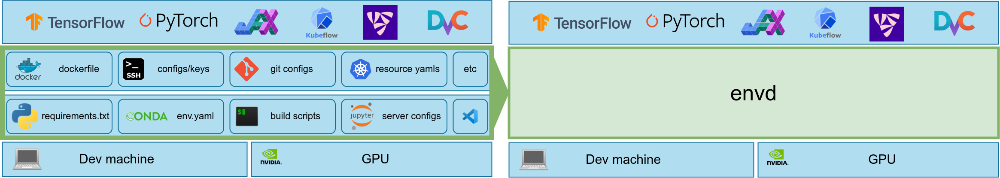

# 为何选择 envd？

目前在 AI/ML 应用程序中配置开发环境和重现结果仍然太困难。

`envd` 是一个面向数据科学和 AI/ML 工程团队的**机器学习开发环境**。使用 `envd` 构建的环境提供以下开箱即用的功能：

🐍 **人生苦短，我用 Python[^1]**

开发环境总是充满了 Dockerfile、bash 脚本、Kubernetes YAML 清单和许多其他总是出问题的笨重文件。 `envd` 构建是独立且干净的。你可以用 Python 编写简单的指令，而不是 Bash / Makefile / Dockerfile / ……



[^1]: 这个构建语言是 [starlark](https://docs.bazel.build/versions/main/skylark/language.html)，是 Python 的一种方言。

⏱️ **节省你的大量时间**

`envd` 采用多级缓存机制来加速构建过程。例如，PyPI 缓存在构建之间共享，因此如果之前下载过该包，则该包将被缓存。它可以节省大量时间，尤其是当你通过反复试验更新环境时。

<table>
<tr>
<td> envd </td> <td>

Docker[^2]

</td>
</tr>
<tr>
<td>

```diff
$ envd build
=> pip install tensorflow       5s
+ => Using cached tensorflow-...-.whl (511.7 MB)
```

</td>
<td>

```diff
$ docker build
=> pip install tensorflow      278s
- => Downloading tensorflow-...-.whl (511.7 MB)
```

</td>
</tr>
</table>

[^2]: Docker 但不使用 [buildkit](https://github.com/moby/buildkit)

☁️ **本地和云原生**

`envd` 与 Docker 无缝集成，你可以通过 Docker Hub 或任何其他 OCI 镜像注册站来共享、版本化和发布 `envd` 环境。 `envd` 环境可以在 Docker 或 Kubernetes 上运行。

🔁 **可重复的构建和可复现的结果**

你可以在笔记本电脑、公共云 VM 或 Docker 容器上重现相同的开发环境，而无需更改任何设置。你也可以与同事协作，而无需“让我给你的机器配置环境”。

🖨️ **在 Jupyter/VSCode 中无缝体验** 

`envd` 为 Jupyter 和 VSCode 远程扩展提供了一流的支持。你可以在不牺牲任何开发人员体验的情况下受益。

## 如果不用 envd，应该怎么搭建机器学习开发环境？

如果训练作业在云端运行，我们必须使用 Docker、conda、CUDA、GPU 驱动程序，甚至 Kubernetes，才能达成。

AI/ML 模型通过反复试验进行优化。环境也将一次又一次地更新、修改或重建。

因此，我们不得不维护这么复杂的 `Dockerfile`。

```docker
FROM nvidia:cuda:11.6.2-devel-ubuntu20.04
RUN apt-get update && \
    apt-get install -y --no-install-recommends \
    --no-install-suggests --fix-missing bash-static \
    python3 curl openssh-server openssh-client \
    git tini sudo python3-pip zsh vim \
    && rm -rf /var/lib/apt/lists/*
RUN groupadd -r normaluser && \
    useradd -r -g normaluser normaluser
USER normaluser
RUN mkdir /var/run/sshd
RUN mkdir /root/.ssh
COPY ./key /root/.ssh/id_rsa
RUN echo 'root:root' |chpasswd
RUN sed -ri \
    's/^#?PermitRootLogin\s+.*/PermitRootLogin yes/' /etc/ssh/sshd_config
RUN sed -ri \
    's/UsePAM yes/#UsePAM yes/g' /etc/ssh/sshd_config
RUN mkdir /home/normaluser/.cache
RUN --mount=type=cache,target=/home/normaluser/.cache \
    pip install --upgrade pip
RUN --mount=type=cache,target=/home/normaluser/.cache \
    pip install tensorflow==2.9.1 numpy jupyter
RUN echo '[user]\n\
        email = anonymous@email.com \n\
        name = Name \n\
[core]\n\
        editor = vim \n' >> /home/normaluser/.gitconfig
RUN wget \
    https://github.com/robbyrussell/oh-my-zsh/raw/master/tools/install.sh -O - | zsh
RUN echo 'set -e\n\
sshd &\n\
python -m jupyter notebook --no-browser --ip=* \
--port=8888 --allow-root --NotebookApp.token=''\n\
wait -n`' >> /init.bash
ENTRYPOINT ["tini", "--", "bash", "init.bash"]
```

## 用 envd 会怎么做?

`envd` 提供类似于 Python 的构建语言，并且在容器技术中对 Jupyter、VSCode 和 Python 依赖项具有一流的支持。

`envd` 中的相同逻辑如下所示：

```python
def build():
    base(os="ubuntu20.04", language="python3")
    install.vscode_extensions([
        "ms-python.python",
    ])
    install.python_packages([
        "tensorflow==2.9.1",
        "numpy",
    ])
    install.cuda(version="11.2.2", cudnn="8")
    shell("zsh")
    config.jupyter()
```

## 谁应该使用 envd?

目前，我们专注于帮助开发 AI/ML 模型的数据科学家和团队。

他们可能苦于：

- 使用 Python、CUDA、Docker、SSH 等构建开发环境。你是否有一个复杂的 Dockerfile 或构建脚本来设置你的所有开发环境，但总是出问题？
- 更新环境。是不是总要问基础架构工程师如何在 Dockerfile 中添加一个新的Python 包？
- 管理环境和机器。你是否总是因为同时处理多个项目而忘记具体项目使用了哪些机器？
