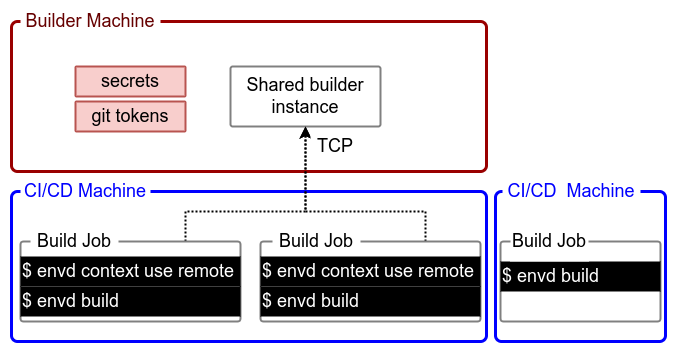

# `envd` 上下文

本篇会详细介绍如何轻松使用一个 `envd` 命令来管理多个构建实例。在 `envd` 上下文的帮助下，你也可以在 CI/CD 系统中使用 `envd` 来构建镜像。

每个 `envd` 命令行都对应多个上下文。每个上下文包含管理不同构建实例的终端和安全信息。构建实例负责构建镜像并保存构建过程中的缓存。每个构建实例都需要有一个独立的 [buildkit daemon](https://github.com/moby/buildkit)。

`envd context` 命令能够轻松设置上下文并进行切换。

## 上下文详解

上下文包含以下几个属性：

- `name`: 上下文名称
- `builder`: `builder` 实例的类型（`docker-container`, `kube-pod`, `tcp`
- `builder-addr`: `builder` 实例的终端
- `runner`: runner 实例的类型 (`docker`, `envd-server`)
- `runner-addr`: runner 实例的终端

了解上下文长什么样子最简单的办法就是运行以下命令：

```bash
$ envd context ls
CONTEXT                 BUILDER                 BUILDER ADDR                            
default (current)       docker-container        docker-container://envd_buildkitd
```

上面显示的是默认的上下文。`envd` 会引导启动一个名叫 `envd_buildkitd` 的 `builder` 实例镜像，并用它来执行所有的 `envd` 命令。

`builder` 用于构建 `envd` 镜像。而 `runner` 是用来运行 `envd` 环境的。有两种类型的 `runner`：`docker` 和 `envd-server`。`envd-server`是一种实验性的 `runner`，用于[在 Kubernetes 上运行 `envd` 环境](./kubernetes.md)。

## 创建一个新的上下文

可以通过 `envd context create` 命令来创建一个新的上下文。

```bash
$ envd context create --name demo \
    --builder-address buildkitd-demo --use --builder docker-container
INFO[2022-08-15T15:33:24+08:00] Context demo is created
INFO[2022-08-15T15:33:24+08:00] Current context is now "demo"
```

参数 `--use` 声明要切换到新创建的上下文。之后执行的所有 `envd` 命令都会跑在这个新的上下文中。

你也可以通过 `envd context use` 在已有的上下文中进行切换。

## 删除一个上下文

可以执行 `envd context rm` 命令来删除一个上下文。

```bash
$ envd context rm --name demo
```

## 远程构建（进阶）

`buildkitd` 构建实例可以跑在远程机器上。这样做有以下好处：

- **不需要安装 Docker**: 你不需要在 CI/CD 的机器上或者其他远程构建机器上安装 Docker。
- **构建速度更快**: 不同构建之间可以共享缓存，因此构建速度可以更快。
- **部署更安全**: 安全密钥和口令存储在构建机器上，CI/CD 里的程序不会访问到这些内容。



### 在远程构建机器上启动 buildkitd

在你运行 `envd` 远程构建之前，请先在远程构建机器上启动 buildkitd 并暴露为一个 TCP 服务。你可以在 [buildkitd 文档](https://github.com/moby/buildkit/blob/master/README.md#expose-buildkit-as-a-tcp-service) 中找到详细信息。

```bash
$ buildkitd \
  --addr tcp://0.0.0.0:8888
  ...
```

::: tip
buildkitd 默认会使用磁盘空间的 10% 作为缓存上限，超过之后会触发垃圾回收。你可以通过修改 `buildkitd.toml` 文件中的 `worker.oci.gckeepstorage` 或 `worker.containerd.gckeepstorage` 来定制。详情可查阅 [buildkit config](https://github.com/moby/buildkit/blob/master/docs/buildkitd.toml.md)。
:::

该程序需要长期运行在机器上，所有的构建都会使用这个服务。

### 在构建任务中创建 `envd` 上下文

让我们在构建任务中创建对应的 `envd` 上下文吧。

```bash
$ envd context create --name remote-context \
  --builder tcp \
  --builder-address <remote-machine-ip>:8888 \
  --use
```

### 在构建任务中创建并推送镜像

你可以通过以下命令构建并推送镜像。

```bash
$ envd build --output type=image,name=docker.io/<username>/<image>,push=true
```

### 非 Root 模式

BuildKitd 默认要求以 root 身份运行。如果你担心安全问题，或者在你的环境中禁止使用特权容器，你可以考虑在非 root 模式下运行 BuildKitd。

- 在本地运行 BuildKitd：你需要先安装 [rootlesskit](https://github.com/rootless-containers/rootlesskit/)

```bash
rootlesskit buildkitd
```

- 在容器中运行 BuildKitd
```bash
docker run \
  --name buildkitd \
  -d \
  --security-opt seccomp=unconfined \
  --security-opt apparmor=unconfined \
  --device /dev/fuse \
  moby/buildkit:rootless --oci-worker-no-process-sandbox
```

- 在 Kubernetes 集群中运行 BuildKitd：请参考 [Kubernetes manifests for BuildKit Document](https://github.com/moby/buildkit/tree/master/examples/kubernetes)
