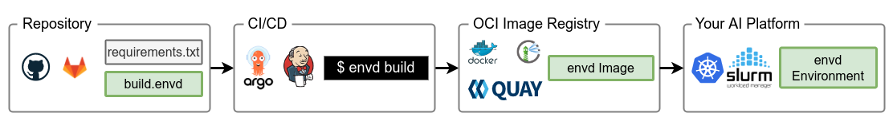

# envd for Your Team

`envd` is designed for teams! 🥰 

This guide shows how easy it is to integrate `envd` into your infrastructure. Please contact us on [💬 Discord](https://discord.gg/KqswhpVgdU) if you have problems, we are glad to help!

## How does it work?

`build.envd` in your git repository contains the configuration of the `envd` environment. `envd build` can be run to build and push the image in CI/CD systems such as GitHub Actions, Jenkins, or Argo. 

Users can push the image to any OCI image registry such as Docker Hub, self-hosted Harbor, or Quay. Then it can be used in the AI/ML platform.



Both AI/ML engineers and infrastructure engineers can benefit from `envd`. AI/ML engineers will

- **Build the environments easily**: You can write simple instructions in Python, instead of Bash / Makefile / Dockerfile / ..., to build the development environments.
- **Reproduce the result**: `envd` builds are isolated and clean. You can reproduce the same development environment on your laptop, public cloud VMs, or Docker containers without any change in setup.
- **Share your work with teammates**: You can share, version, and publish `envd` environments with Docker Hub or other OCI image registries.

Infrastructure engineers can:

- **Manage boundaries and expectations with AI/ML teams**: `envd` helps get clear boundaries and expectations between the infrastructure and AI/ML teams. AI/ML engineers can build the environments without asking you for help. You get more time to focus on the infrastructure.
- **Maintain `envd` with low cost**: `envd` images can be published in any OCI image registries. There is no new requirement to use `envd`.
- **Use `envd` in your CI/CD platforms**: `envd` integrates with CI/CD platforms well.
- **Save your time and resources**: `envd` supports shared build cache and features like [remote build](/teams/context). It saves you plenty of time.

## Build and push the image

You can use the command below to build and push images to Docker Hub.

```bash
$ envd build --output type=image,name=docker.io/<username>/<image>,push=true
```

Keys supported by image output:

- `type=image`: The output type is image.
- `name=<value>`: specify image name(s)
- `push=true`: push after creating the image

## Use the image

`envd` images contains a sshd server and a conda environment `envd` by default. The sshd server listens on port 2222. You may need to expose the port in your Kubernetes deployment.

Besides this, the source code is not in the image. Thus you may need to integrate the source code into the image.
