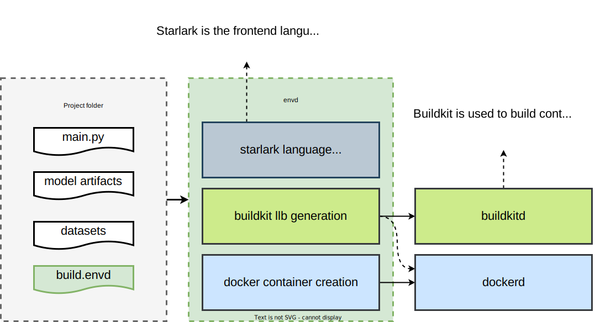

# Development Tutorial

Thanks for your interest in contributing to `envd` 🌟!

Our community values contributions of all forms and seeks to expand the meaning of the word "contributor" as far and wide as possible. Our [contributing](/community/contributing) page gives an overview of some different ways to get involved and contribute. For technical contributions, read on to get started.

## Repository file structure

The `envd` source code lives in [github.com/tensorchord/envd](https://github.com/tensorchord/envd). Besides this, the documentation source code lives in [github.com/tensorchord/envd-docs](https://github.com/tensorchord/envd-docs).

There are a lot of files here! Here's a brief overview. It can be confusing, but you don't need to understand every file in the repository to get started. We recommend beginning in one area (for example, adding a new function in `envd`), and working your way outwards to exploring more.

- [📁 base-images/](https://github.com/tensorchord/envd/tree/main/base-images) contains Dockerfiles and build scripts of the base images used in envd.
- [📁 cmd/](https://github.com/tensorchord/envd/tree/main/cmd) contains the command line interface `envd` and `envd-sshd`.
    - [📁 envd/](https://github.com/tensorchord/envd/tree/main/cmd/envd) the main command line interface.
    - [📁 envd-sshd/](https://github.com/tensorchord/envd/tree/main/cmd/envd-sshd) `envd-sshd` will not be used directly by envd users. It will be injected into the environment to set up the sshd.
- [📁 docs/](https://github.com/tensorchord/envd/tree/main/docs) does not actually contain docs! Rather, it contains the proposals or static assets used in `README.md`. The docs lives in [github.com/tensorchord/envd-docs](https://github.com/tensorchord/envd-docs).
- [📁 envd/](https://github.com/tensorchord/envd/tree/main/envd) contains a fake python package which is only used to generate `envd` API reference. You do not need to take care of it if you do not change the `envd` API.
- [📁 examples/](https://github.com/tensorchord/envd/tree/main/examples) contains some examples of `envd`.
- [📁 pkg/](https://github.com/tensorchord/envd/tree/main/pkg) contains the implementation of `envd` command line interface.
    - [📁 app/](https://github.com/tensorchord/envd/tree/main/pkg/app) contains the command line interface configuration.
    - [📁 autocomplete/](https://github.com/tensorchord/envd/tree/main/pkg/autocomplete) contains bash and zsh completion code for the command line interface.
    - [📁 builder/](https://github.com/tensorchord/envd/tree/main/pkg/builder) contains the buildkit builder, which is one of the most important parts. The builder compiles starlark to [buildkit LLB](https://github.com/moby/buildkit#exploring-llb), then builds the image.
    - [📁 buildkitd/](https://github.com/tensorchord/envd/tree/main/pkg/buildkitd) contains the client code to connect to the buildkitd container.
    - [📁 config/](https://github.com/tensorchord/envd/tree/main/pkg/config) contains the `envd` configuration.
    - [📁 editor/](https://github.com/tensorchord/envd/tree/main/pkg/editor) contains vscode or jupyter related implementation.
    - [📁 envd/](https://github.com/tensorchord/envd/tree/main/pkg/envd) contains the `envd` engine, which is the abstraction to manage `envd` environments.
    - [📁 flag/](https://github.com/tensorchord/envd/tree/main/pkg/flag) contains the information of [viper](https://github.com/spf13/viper) flags.
    - [📁 home/](https://github.com/tensorchord/envd/tree/main/pkg/home) contains the code to manage [XDG directories](https://specifications.freedesktop.org/basedir-spec/basedir-spec-latest.html) (e.g. `$HOME/.config/envd` and `$HOME/.cache/envd`).
    - [📁 lang/](https://github.com/tensorchord/envd/tree/main/pkg/lang) contains the build language code. If you want to add a new function to envd, you need to update this package.
    - [📁 progress/](https://github.com/tensorchord/envd/tree/main/pkg/progress) contains the build progress output code. You do not need to take care of it most of time.
    - [📁 remote/](https://github.com/tensorchord/envd/tree/main/pkg/remote) contains sshd implementation. You do not need to take care of it most of time.
    - [📁 shell/](https://github.com/tensorchord/envd/tree/main/pkg/shell) contains zsh-related code.
    - [📁 ssh/](https://github.com/tensorchord/envd/tree/main/pkg/ssh) contains a ssh client which is used to attach to the container when running `envd up`.
    - [📁 types/](https://github.com/tensorchord/envd/tree/main/pkg/types) defines some types used in [📁 pkg/envd](https://github.com/tensorchord/envd/tree/main/pkg/envd).

## Development Process

The steps below walk you through the setup process. If you have questions, you can ask on [discord](https://discord.gg/KqswhpVgdU) or post an issue that describes the place you are stuck, and we'll do our best to help.

1. Install [Docker](https://www.docker.com/products/docker-desktop/) (20.10.0 or above) and [Golang](https://go.dev/dl/) (1.18 or above).
2. [Fork](https://help.github.com/articles/fork-a-repo) the [`envd` repository](https://github.com/tensorchord/envd) into your own GitHub account. (Remember to uncheck the "Copy the `main` branch only")
3. Clone your new fork of the repository from GitHub onto your local computer.
    ```bash
    $ git clone https://github.com/YOUR_USERNAME/envd.git
    # or using gh CLI (this will help you set up the upstream automatically)
    $ gh repo clone YOUR_USERNAME/envd
    ```
4. Install the dependencies and compile `envd`. Make sure you can get the correct version from git tags.
    ```bash
    $ go mod tidy
    $ make
    $ ./bin/envd bootstrap
    $ ./bin/envd version
    ```
5. Make some changes locally to the codebase and commit them with Git.
    ```bash
    $ git checkout -b NEW_BRANCH_NAME
    $ git add -u
    $ git commit -s -m "YOUR COMMIT MESSAGE"
    ```
6. [Push](https://docs.github.com/en/get-started/using-git/pushing-commits-to-a-remote-repository) your new changes to your fork on GitHub.
    ```bash
    $ git config --global --add --bool push.autoSetupRemote true
    $ git push
    ```
7. [Create a Pull Request](https://docs.github.com/en/pull-requests/collaborating-with-pull-requests/proposing-changes-to-your-work-with-pull-requests/creating-a-pull-request) on the GitHub repo page.
    - PR title should start with `feat`/`docs`/`fix`/`refactor` etc., following the [Conventional Commits spec](https://www.conventionalcommits.org/en/v1.0.0/).
    - Describe the purpose of this PR, link to the relevant issue.
    - Invite the owner to review your PR.

### Lint

You could run the command below

```bash
make lint
```

You should see output similar to the following if there is any linting issue:

```
cmd/envd/main.go:36:67: Revision not declared by package version (typecheck)
                fmt.Println(c.App.Name, version.Package, c.App.Version, version.Revision)
                                                                                ^
make: *** [Makefile:102: lint] Error 1
```

### Running tests

To run tests you can issue

```bash
make test
```

### Debug with VSCode

```bash
make debug
```

## `envd up` from a developer's perspective

`envd` interprets all statements in `build.envd` and executes `build()`. The function calls such as [`install.python_packages`](../api/starlark/v0/install#python_packages) and [`config.jupyter`](../api/starlark/v0/config#jupyter) register information to envd's in-memory static graph. Then `envd` constructs the [buildkit LLB DAG graph](https://github.com/moby/buildkit#exploring-llb) according to the information and uses it to build resulting image.



## GitHub Issue Flow

- Issues tagged as [`good first issue 💖`](https://github.com/tensorchord/envd/issues?q=is%3Aissue+is%3Aopen+label%3A%22good+first+issue+%E2%9D%A4%EF%B8%8F%22) are a good place to get started.
- If you'd like to start working on an existing issue, comment on the issue that you plan to work on it so other contributors know it's being handled and can offer help.
