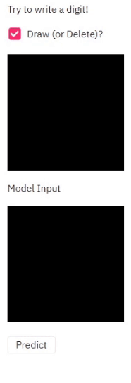

# Multi-target Build

Sometimes you need build different images for development, serving or other purposes. This guide shows how `envd build` supports multi-target build.

A `build.envd` can have multiple build targets. The default build target in `build.envd` is `build`:

```py
def build():
    # ...
```

## Create a new build target

New build targets can be defined as functions in `build.envd`:

```py
def build():
    # ...
def serve():
    # ...
```

## Example

`envd build -f :<target>` executes the build for the given target. Here is an [example](https://github.com/tensorchord/envd/tree/main/examples/streamlit-mnist).

```py
def build():
    base(os="ubuntu20.04", language="python3")
    install.vscode_extensions([
        "ms-python.python",
    ])

    configure_mnist()
    # Configure jupyter notebooks.
    config.jupyter()
    # Configure zsh.
    shell("zsh")

def serve():
    base(os="ubuntu20.04", language="python3")
    configure_streamlit(8501)
    configure_mnist()

def configure_streamlit(port):
    install.python_packages([
        "streamlit",
        "streamlit_drawable_canvas",
    ])
    runtime.expose(envd_port=port, host_port=port, service="streamlit")
    runtime.daemon(commands=[
        ["streamlit", "run", "~/streamlit-mnist/app.py"]
    ])

def configure_mnist():
    # config.pip_index(url = "https://pypi.tuna.tsinghua.edu.cn/simple")
    install.system_packages([
        "libgl1",
    ])
    install.python_packages([
        "tensorflow",
        "numpy",
        "opencv-python",
        "matplotlib",
    ])
```

This demo contains two parts: training a simple digit recognition model using mnist dataset and a webapp to live demo that model.

<p align="center">

{ style="display: block; margin: 0 auto" }

</p>

Steps to run the example are shown here.

1. First create the development environment.

    ```
    envd up
    ```

2. Train model

    Run all the cells of [train.ipynb](train.ipynb) manually.

3. Run demo web-app

    ```
    envd up -f :serve
    ```
