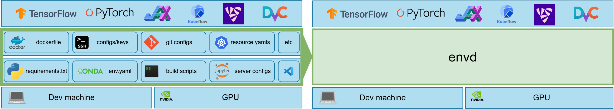

# Why Use envd?

It is still too difficult to configure development environments and reproduce results in AI/ML applications.

`envd` is a **machine learning development environment** for data science and AI/ML engineering teams. Environments built with `envd` provide the following features out-of-the-box:

🐍 **Life is short, use Python[^1]**

Development environments are full of Dockerfiles, bash scripts, Kubernetes YAML manifests, and many other clunky files that are always breaking. `envd` builds are isolated and clean. You can write simple instructions in Python, instead of Bash / Makefile / Dockerfile / ...



[^1]: The build language is [starlark](https://docs.bazel.build/versions/main/skylark/language.html), which is a dialect of Python.

⏱️ **Save you plenty of time**

`envd` adopts a multi-level cache mechanism to accelerate the building process. For example, the PyPI cache is shared across builds and thus the package will be cached if it has been downloaded before. It saves plenty of time, especially when you update the environment by trial and error.

<table>
<tr>
<td> envd </td> <td>

Docker[^2]

</td>
</tr>
<tr>
<td>

```diff
$ envd build
=> pip install tensorflow       5s
+ => Using cached tensorflow-...-.whl (511.7 MB)
```

</td>
<td>

```diff
$ docker build
=> pip install tensorflow      278s
- => Downloading tensorflow-...-.whl (511.7 MB)
```

</td>
</tr>
</table>

[^2]: Docker without [buildkit](https://github.com/moby/buildkit)

☁️ **Local & cloud native**

`envd` integrates seamlessly with Docker, you can share, version, and publish `envd` environments with Docker Hub or any other OCI image registries. The `envd` environments can be run on Docker or Kubernetes.

🔁 **Repeatable builds & reproducible results**

You can reproduce the same dev environment, on your laptop, public cloud VMs, or Docker containers, without any change in setup. You can also collaborate with your colleagues without "let me configure the environment in your machine".

🖨️ **Seamless experience of Jupyter/VSCode** 

`envd` provides first-class support for Jupyter and VSCode remote extension. You benefit without sacrificing any developer experience.

## How to build a machine learning development environment, without envd?

We have to play with Docker, conda, CUDA, GPU Drivers, and even Kubernetes if the training jobs are running in the cloud, to make things happen.

AI/ML models are optimized by trials and errors. And the environment will be updated, modified, or rebuilt again, and again, in place. 

Thus, we have to maintain such a complicated `Dockerfile`.

```docker
FROM nvidia:cuda:11.6.2-devel-ubuntu20.04
RUN apt-get update && \
    apt-get install -y --no-install-recommends \
    --no-install-suggests --fix-missing bash-static \
    python3 curl openssh-server openssh-client \
    git tini sudo python3-pip zsh vim \
    && rm -rf /var/lib/apt/lists/*
RUN groupadd -r normaluser && \
    useradd -r -g normaluser normaluser
USER normaluser
RUN mkdir /var/run/sshd
RUN mkdir /root/.ssh
COPY ./key /root/.ssh/id_rsa
RUN echo 'root:root' |chpasswd
RUN sed -ri \
    's/^#?PermitRootLogin\s+.*/PermitRootLogin yes/' /etc/ssh/sshd_config
RUN sed -ri \
    's/UsePAM yes/#UsePAM yes/g' /etc/ssh/sshd_config
RUN mkdir /home/normaluser/.cache
RUN --mount=type=cache,target=/home/normaluser/.cache \
    pip install --upgrade pip
RUN --mount=type=cache,target=/home/normaluser/.cache \
    pip install tensorflow==2.9.1 numpy jupyter
RUN echo '[user]\n\
        email = anonymous@email.com \n\
        name = Name \n\
[core]\n\
        editor = vim \n' >> /home/normaluser/.gitconfig
RUN wget \
    https://github.com/robbyrussell/oh-my-zsh/raw/master/tools/install.sh -O - | zsh
RUN echo 'set -e\n\
sshd &\n\
python -m jupyter notebook --no-browser --ip=* \
--port=8888 --allow-root --NotebookApp.token=''\n\
wait -n`' >> /init.bash
ENTRYPOINT ["tini", "--", "bash", "init.bash"]
```

## How to do with envd?

`envd` provides build language similar to Python and has first-class support for jupyter, vscode, and python dependencies in container technologies.

The same logic in `envd` looks like this:

```python
def build():
    base(os="ubuntu20.04", language="python3")
    install.vscode_extensions([
        "ms-python.python",
    ])
    install.python_packages([
        "tensorflow==2.9.1",
        "numpy",
    ])
    install.cuda(version="11.6", cudnn="8")
    shell("zsh")
    config.jupyter(password="")
```

## Who should use envd?

Currently, we’re focused on helping data scientists and teams that develop AI/ML models. And they may suffer from:

- building the development environments with Python, CUDA, Docker, SSH, and so on. Do you have a complicated Dockerfile or build script that sets up all your dev environments, but is always breaking?
- Updating the environment. Do you always need to ask infrastructure engineers how to add a new python package in the Dockerfile?
- Managing environments and machines. Do you always forget which machines are used for the specific project, because you handle multiple projects concurrently?
