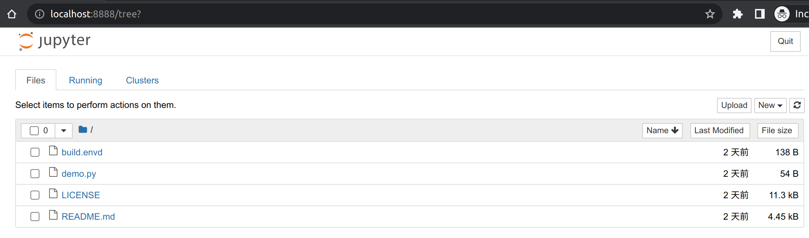

# Running Your First Environment

`envd` can build images automatically by reading the instructions from a `build.envd`. A `build.envd` is a text document that contains all the commands a user could call on the command line to assemble an image.

## Usage

The `envd build` command builds an image from a `build.envd`. `envd up` command builds an image and runs immediately. Traditionally, the `build.envd` and located in the root of the context. You use the `--path` or `-p` flag with `envd build`/`envd up` to point to a directory anywhere in your file system which contains a `build.envd`.

```bash
$ ls
build.envd ...
$ envd build
```

```bash
# Or you can specify the path.
$ tree .
./examples
└── mnist
    ├── build.envd
    ├── main.py
    ├── mnist.ipynb
    └── README.md
$ envd build --path examples/mnist
```

## build.envd Example

The syntax of `build.envd` is [Starlark](https://bazel.build/rules/language), a simplified dialect of Python3. If you know Python, then you can write `build.envd` without an issue.

Here is an example of `build.envd`:

<custom-title title="build.envd">

```python
def build():
    base(dev=True)
    install.conda()
    install.python()
    install.python_packages(name = [
        "numpy",
    ])
    shell("fish")
    config.jupyter()
```

</custom-title>


You don't need to worry about it yet. Let's explore how it works in the following sections.

### Hello World

You can create a file `build.envd` in your project directory with these lines:

<custom-title title="build.envd">

```python
def build():
    base(dev=True)
    install.conda()
    install.python()
```

</custom-title>

You can save the file and run `envd up`. Congrats! You get your first `envd` environment.

<custom-title title="envd up shell">

```bash
$ envd up
[+] ⌚ parse build.envd and download/cache dependencies 0.0s ✅ (finished) 
[+] 🐋 build envd environment 7.9s (16/16) ✅ (finished)
 ...
 => exporting to oci image format                                      0.4s
 => => exporting layers                                                0.0s
 => => exporting manifest sha256:7ef2e8571485ce51d966b4cf5fe83232520f  0.0s
 => => exporting config sha256:abec960de30fce69dc19126577c7aaae3f9b62  0.0s
 => => sending tarball                                                 0.4s
⬢ [envd]❯ 
```

</custom-title>

You can use `ssh <project-directory-name>.envd` to attach to the environment if you exit from the shell. This name can also be customized via `envd up --name <custom-name>`.

<custom-title title="connect the environment via ssh">

```bash 
⬢ [envd]❯ exit
# to list the current available envd environments
$ envd envs ls
# to re-connect to the environment
$ ssh <project-directory-name>.envd
⬢ [envd]❯ # You are in the environment again!
```

</custom-title>

Do not forget to remove the environment if you do not use it. Use the `-p` flag to specify the path of the environment to destroy.

<custom-title title="destroy the environment">

```text 
$ envd destroy -p .
INFO[2022-06-10T19:09:49+08:00] <project-directory-name> is destroyed
```

</custom-title>

### build.envd

Let's have a look at `build.envd`.

<custom-title title="build.envd">

```python
def build():
    base(dev=True)
    install.conda()
    install.python()
```

</custom-title>

`build` is the default function name in `build.envd`. `envd` invokes the function if you run `envd build` or `envd up`.

:::warning

**A `build.envd` must have a `build` function**.

:::

`base` declares the expected operating system and language that you will use in the environment.

### Install python packages

The [`envd` install API](../api/starlark/v0/install) function `install.python_packages` installs python packages in the environment:

<custom-title title="build.envd">

```python 
def build():
    base(dev=True)
    install.conda()
    install.python()
    install.python_packages(name = [
        "numpy",
    ])
```

</custom-title>

The function supports general pip syntaxs:

```python
install.python_packages(name = [
    "numpy==1.4.1",
    "numpy>=1,<2",
    "numpy~=1.4",
])
```

Feel free to ask us in [Discord](https://discord.gg/KqswhpVgdU) if you get problems about packages installation. You can verify if it works:

```
$ envd up
⬢ [envd]❯ python3
Python 3.11.11 (main, Dec 11 2024, 16:28:39) [GCC 11.2.0] on linux
Type "help", "copyright", "credits" or "license" for more information.
>>> import numpy as np
>>> a = np.array([2, 3, 4])
>>> a
array([2, 3, 4])
```

### Use zsh instead of bash

The [`envd` API](../api/starlark/v0/global) function `shell` configures shell program in the environment:

<custom-title title="build.envd">

```python 
def build():
    base(dev=True)
    install.conda()
    install.python()
    install.python_packages(name = [
        "numpy",
    ])
    shell("zsh")
```
</custom-title>

You do not need to configure zsh and [oh-my-zsh](https://ohmyz.sh/) manually, `envd` does it.

```bash
$ envd up
(envd) ➜  docs # zsh in the environment
```

### Use Jupyter Notebook

[Jupyter Notebook](https://jupyter.org/) are a powerful way to write and iterate on your Python code for data analysis. The [`envd` config API](../api/starlark/v0/config) function `config.jupyter` helps you set up Jupyter Notebook in the environment:

<custom-title title="build.envd">

```python 
def build():
    base(dev=True)
    install.conda()
    install.python()
    install.python_packages(name = [
        "numpy",
    ])
    shell("zsh")
    config.jupyter()
```

</custom-title>

After the `envd up` command is executed successfully, check the address of Jupyter Notebook by `envd envs list`.

```bash
$ envd up --detach
$ envd get env
NAME                    JUPYTER                 SSH TARGET              CONTEXT                                 IMAGE                   GPU     CUDA    CUDNN   STATUS          CONTAINER ID
envd-quick-start        http://localhost:48484   envd-quick-start.envd   /home/gaocegege/code/envd-quick-start   envd-quick-start:dev    false   <none>  <none>  Up 54 seconds   bd3f6a729e94
```



### Set a PyPI index mirror (optional)

You can use the `envd` API function `config.pip_index` to set the PyPI index mirror if it is too slow to install the python packages via `install.python_packages`.

<custom-title title="build.envd">

```python

```python 
def build():
    config.pip_index(url="https://pypi.tuna.tsinghua.edu.cn/simple")
    base(dev=True)
    install.conda()
    install.python()
    install.python_packages(name = [
        "numpy",
    ])
    shell("zsh")
    config.jupyter()
```

</custom-title>

Then the packages will be downloaded from the mirror instead of [pypi.org](https://pypi.org/).

### Complex build.envd example

```python
def build():
    config.apt_source(source="""
deb https://mirror.sjtu.edu.cn/ubuntu focal main restricted
deb https://mirror.sjtu.edu.cn/ubuntu focal-updates main restricted
deb https://mirror.sjtu.edu.cn/ubuntu focal universe
deb https://mirror.sjtu.edu.cn/ubuntu focal-updates universe
deb https://mirror.sjtu.edu.cn/ubuntu focal multiverse
deb https://mirror.sjtu.edu.cn/ubuntu focal-updates multiverse
deb https://mirror.sjtu.edu.cn/ubuntu focal-backports main restricted universe multiverse
deb http://archive.canonical.com/ubuntu focal partner
deb https://mirror.sjtu.edu.cn/ubuntu focal-security main restricted universe multiverse
""")
    config.pip_index(url = "https://mirror.sjtu.edu.cn/pypi/web/simple")
    install.vscode_extensions([
        "ms-python.python",
    ])
    base(dev=True)
    install.conda()
    install.python()
    install.python_packages(name = [
        "numpy",
    ])
    install.cuda(version="11.2.2", cudnn="8")
    shell("zsh")
    install.apt_packages(name = [
        "htop"
    ])
    git_config(name="Ce Gao", email="cegao@tensorchord.ai", editor="vim")
    run(["ls -la"])
```

## Next Steps

Congrats! `envd` is now setup for your project. Explore `envd` further!

Please ask us on [Discord](https://discord.gg/KqswhpVgdU) if you had any trouble using this guide.

Here are some quick links:

- [`envd` GitHub Repository](https://github.com/tensorchord/envd)
- [Why Use `envd`?](/faq/why)
- [`envd` CLI Reference](/api/cli/cli)
