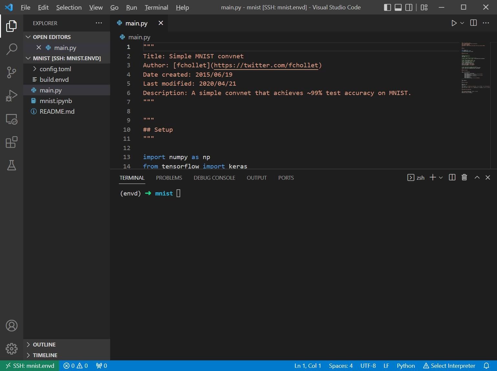
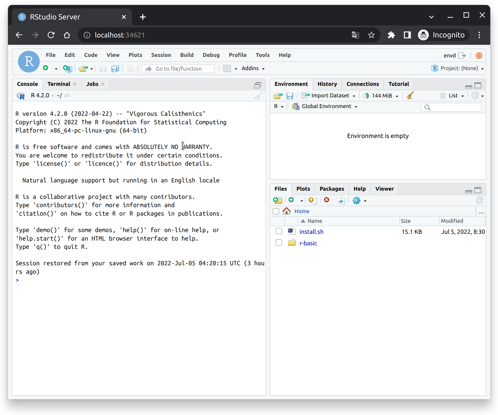

# Using `envd` Environment

Here we use the example at [envd/examples/mnist](https://github.com/tensorchord/envd/tree/main/examples/mnist).

## Build your environment

Following [previous tutorial](/guide/build-envd), you'll be able to setup the project environment by `envd`. In this tutorial, we used `mnist` project.
After setting up the project, you can check the environment status by `envd envs list`.

```bash
$ envd envs list
NAME    JUPYTER                 SSH TARGET      CONTEXT                                         IMAGE           GPU     CUDA    CUDNN   STATUS          CONTAINER ID 
mnist   http://localhost:48484   mnist.envd      /home/ubuntu/workspace/envd/examples/mnist      mnist:dev       false   <none>  <none>  Up 2 hours      f3452559ee20
```

:::tip

`envd` will add a new ssh entry to your ssh config to help you connect to your environment, named `<project_name>.envd`.


:::
## Connect to the environment with VSCode

First, you need to install the remote development kit in VSCode. You can find here [Remote - SSH](https://marketplace.visualstudio.com/items?itemName=ms-vscode-remote.remote-ssh) to install the extension. After the extension is installed, you'll be able to see the UI below by clicking the downside left icon.


Then click the `Connect to Host` option and select the target you want to connect to.


After selecting the target, open the folder with your project name (here we use `mnist`)


Then everything is done!


## Connect to the environment with Jupyter Notebook

In `build.envd` file, we've declared the jupyter environment, with no password.

```python
def build():
    ...
    config.jupyter()
```

You can also get the jupyter port through `envd envs list` command.

```bash
$ envd envs list
NAME    JUPYTER                 SSH TARGET      CONTEXT                                         IMAGE           GPU     CUDA    CUDNN   STATUS          CONTAINER ID 
mnist   http://localhost:48737   mnist.envd      /home/ubuntu/workspace/envd/examples/mnist      mnist:dev       false   <none>  <none>  Up 2 hours      f3452559ee20
```

Then you can directly get your jupyter notebook by using `http://localhost:48737` in your browser.


## Connect to the environment with RStudio server

You can set up [RStudio server](https://www.rstudio.com/products/rstudio/download-server/) with `config.rstudio_server`.

<custom-title title="build.envd">

```python
def build():
    ...
    config.rstudio_server()
```

</custom-title>

Endpoint can be got through `envd envs list` command.

```bash
$ envd envs list
NAME    ENDPOINT                        SSH TARGET      IMAGE           GPU     CUDA    CUDNN   STATUS          CONTAINER ID 
r-basic rstudio: http://localhost:34621 r-basic.envd    r-basic:dev     false   <none>  <none>  Up 6 hours      1eb7d40e5a8a
```

Then you can connect to the RStudio server by using `http://localhost:34621` in your browser. Please use `envd` as the username, and the password can be any string.




## Expose your services to the public

Currently, you can expose local services to the public network through tools such as [localtunnel](https://github.com/localtunnel/localtunnel).

```bash
$ envd envs list
NAME    JUPYTER                 SSH TARGET      CONTEXT                                         IMAGE           GPU     CUDA    CUDNN   STATUS          CONTAINER ID
mnist   http://localhost:48737   mnist.envd      /home/ubuntu/workspace/envd/examples/mnist      mnist:dev       false   <none>  <none>  Up 2 hours      f3452559ee20
$ npx localtunnel --port 48737
your url is: https://xxx.loca.lt
```
