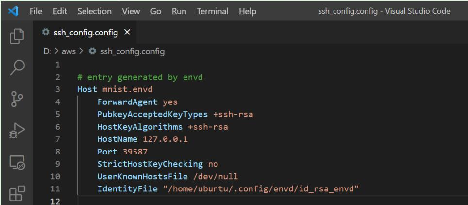
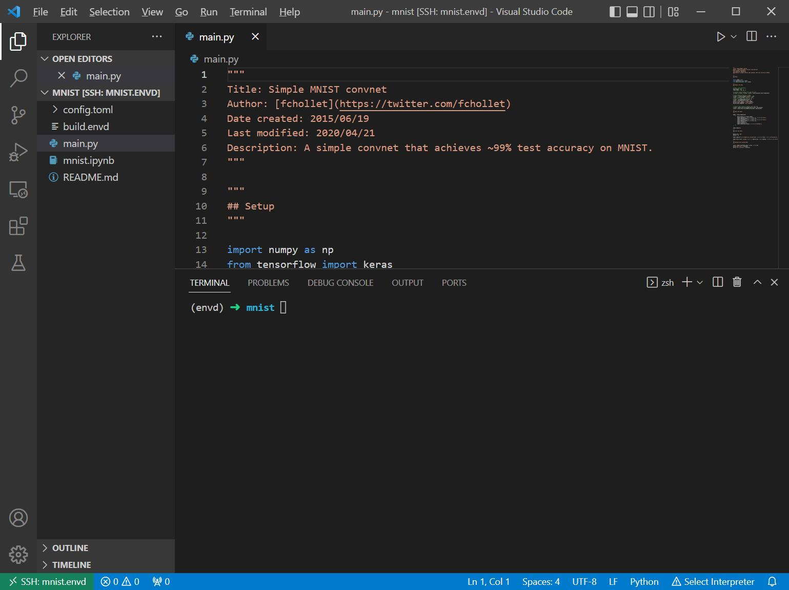

# Connect to envd environment

Here we use the example at [envd/examples/mnist](https://github.com/tensorchord/envd/tree/main/examples/mnist).

## Build and check your environment

Following [previous tutorial](../build-envd), you'll be able to setup the project environment by envd. In this tutorial, we used `mnist` project.
After setting up the project, you can check the environment status by `envd get envs`.

```
➜  envd get envs
NAME    JUPYTER                 SSH TARGET      CONTEXT                                         IMAGE           GPU     CUDA    CUDNN   STATUS          CONTAINER ID 
mnist   http://localhost:8888   mnist.envd      /home/ubuntu/workspace/envd/examples/mnist      mnist:dev       false   <none>  <none>  Up 2 hours      f3452559ee20
```


:::tip

Envd will add a new ssh entry to your ssh config to help you connect to your environment, named `<project_name>.envd`.


:::

## Connect to the environment with VSCode

First, you need to install the remote development kit in VSCode. You can click [here](vscode:extension/ms-vscode-remote.remote-ssh) to install the extension. After the extension is installed, you'll be able to see the UI below by clicking the downside left icon.


Then click the `Connect to Host` option and select the target you want to connect to.


After selecting the target, open the folder with your project name (here we use `mnist`)


Then everything is done!



## Connect to the environment with Jupyter Notebook

In `build.envd` file, we've declared the jupyter environment, with no password and serving at port 8888.

```python title=build.envd
def build():
    ...
    config.jupyter(password="", port=8888)
```

You can also get the jupyter port through `envd get envs` command.

```
➜  envd get envs
NAME    JUPYTER                 SSH TARGET      CONTEXT                                         IMAGE           GPU     CUDA    CUDNN   STATUS          CONTAINER ID 
mnist   http://localhost:8888   mnist.envd      /home/ubuntu/workspace/envd/examples/mnist      mnist:dev       false   <none>  <none>  Up 2 hours      f3452559ee20
```

Then you can directly get your jupyter notebook by using `http://localhost:8888` in your browser

