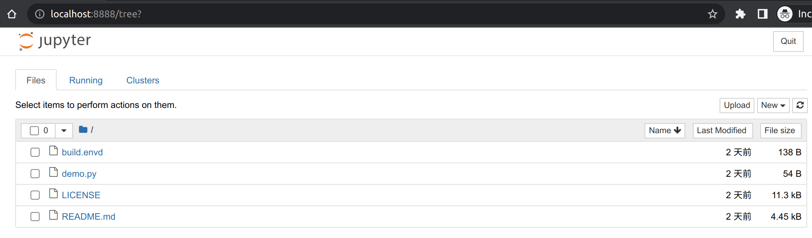

# Building a Python Environment

This guide covers configuring Python environments in envd. If you’re new to envd please read our [Tutorial](../get-started) and [build configuration guides](../build-envd) first.

Let's begin 🐍!

## Specifying Python

The default language in envd is Python, thus there is no need to specify language. Or you can use `base` function to specify.

```python title=build.envd
def build():
    base(os="ubuntu20.04", language="python")
```

## Conda packages

You can install conda packages with `install.conda_packages` function. The following example installs `numpy` and `scipy`:

```python title=build.envd
def build():
    base(os="ubuntu20.04", language="python")
    install.conda_packages(name = [
        "numpy",
        "scipy",
    ])
```

## PyPI packages

You can install Python packages from PyPI with `install.python_packages` function. The following example installs `scikit-learn` and `matplotlib`:

```python title=build.envd
def build():
    base(os="ubuntu20.04", language="python")
    install.python_packages(name = [
        "scikit-learn",
        "matplotlib",
    ])
```

envd uses system-wide [pip](https://pip.pypa.io/) to install Python packages in the previous example.

If conda is enabled, you can also install Python packages from PyPI with `install.python_packags` function. The following example installs `numpy` and `scipy` with conda, and installs `scikit-learn` and `matplotlib` with pip:

```python title=build.envd
def build():
    base(os="ubuntu20.04", language="python")
    install.conda_packages(name = [
        "numpy",
        "scipy",
    ])
    install.python_packages(name = [
        "scikit-learn",
        "matplotlib",
    ])
```

envd uses pip in the current conda environment to install the packages in this example.

## Specifying shell program

You can specify shell program used in the environment with `shell` function. The following example uses `zsh`:

```python title=build.envd
def build():
    base(os="ubuntu20.04", language="python")
    shell("zsh")
```

## Specifying VSCode extensions

You can specify VSCode extensions with `install.vscode_extensions` function. The following example installs [`ms-python.python`](https://open-vsx.org/extension/ms-python/python)[^1]:

```python title=build.envd
def build():
    base(os="ubuntu20.04", language="python")
    install.vscode_extensions(["ms-python.python"])
```

[^1]: [open-vsx](https://open-vsx.org/) is used instead of Microsoft VSCode Marketplace due to [licensing issues](https://github.com/tensorchord/envd/issues/160).

## Setting up the Jupyter notebook

You can set up the Jupyter notebook with `config.jupyter` function. The following example sets up a Jupyter notebook:

```python title=build.envd
def build():
    base(os="ubuntu20.04", language="python")
    # Use `config.jupyter(password="")` 
    # if you do not need to set up password.
    config.jupyter(password="password")
```



## Setting up PyPI index mirror

Mirroring or caching of PyPI can be used to speed up local package installation, allow offline work, handle corporate firewalls or just plain Internet flakiness.

PyPI index mirror can be set with `config.pip_index(url="<index>", extra_url=<extra>)`:

```python title="pip index mirror"
config.pip_index(url="https://pypi.tuna.tsinghua.edu.cn/simple")
```
