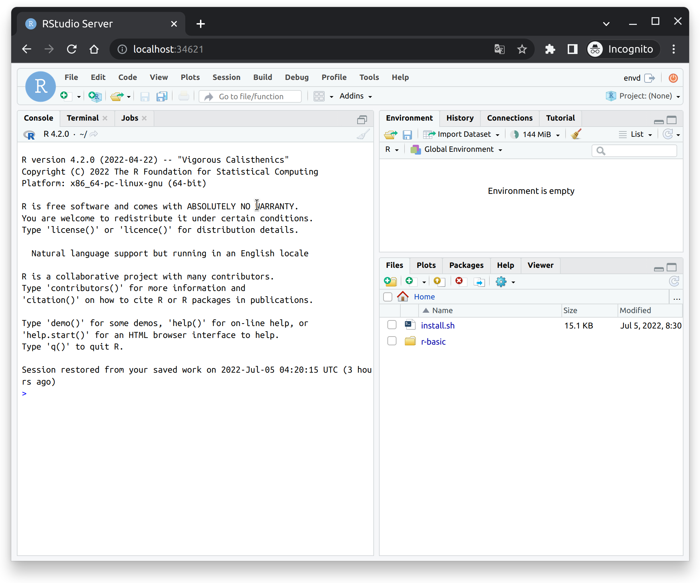

# Building an R Environment

This guide covers configuring R environments in `envd`. If you’re new to `envd` please read our [Tutorial](/guide/getting-started) and [build configuration guides](/guide/build-envd) first.


## Specifying R

First, you can specify to use the R language in the `base` function.

<custom-title title="build.envd">

```python 
def build():
    base(dev=True)
    install.r_lang()
```

</custom-title>

## R packages

You can install R packages with `install.r_packages` function. The following example installs `remotes` and `rlang` packages:

<custom-title title="build.envd">

```python 
def build():
    base(dev=True)
    install.r_lang()
    install.r_packages([
            "remotes",
            "rlang",
        ])
```
</custom-title>

## Configuring CRAN Mirror

By default, the RStudio CRAN mirror `"https://cran.rstudio.com"` is used when downloading and installing R packages. However, you can specify any other mirrors via `config.cran_mirror()` like the following:

<custom-title title="build.envd">

```python 
def build():
    base(dev=True)
    install.r_lang()
    config.cran_mirror(url="https://cloud.r-project.org/")
    install.r_packages([
            "remotes",
            "rlang",
        ])
```
</custom-title>

## Specifying shell program

You can specify shell program used in the environment with `shell` function. The following example uses `zsh`:

<custom-title title="build.envd">

```python 
def build():
    base(dev=True)
    install.r_lang()
    shell("zsh")
```

</custom-title>

## Specifying VSCode extensions

You can specify VSCode extensions with `install.vscode_extensions` function. The following example installs [`REditorSupport.r-lsp`](https://open-vsx.org/extension/REditorSupport/r-lsp)[^1]:

<custom-title title="build.envd">

```python 
def build():
    base(dev=True)
    install.r_lang()
    install.vscode_extensions(["REditorSupport.r-lsp"])
```
</custom-title>

[^1]: [open-vsx](https://open-vsx.org/) is used instead of Microsoft VSCode Marketplace due to [licensing issues](https://github.com/tensorchord/envd/issues/160).

## Setting up RStudio server

You can set up [RStudio server](https://www.rstudio.com/products/rstudio/download-server/) with `config.rstudio_server`.

<custom-title title="build.envd">

```python
def build():
    ...
    config.rstudio_server()
```

</custom-title>

Endpoint can be got through `envd envs list` command.

```bash
$ envd envs list
NAME    ENDPOINT                        SSH TARGET      IMAGE           GPU     CUDA    CUDNN   STATUS          CONTAINER ID 
r-basic rstudio: http://localhost:34621 r-basic.envd    r-basic:dev     false   <none>  <none>  Up 6 hours      1eb7d40e5a8a
```

Then you can connect to the RStudio server by using `http://localhost:34621` in your browser. Please use `envd` as the username, and the password can be any string.



