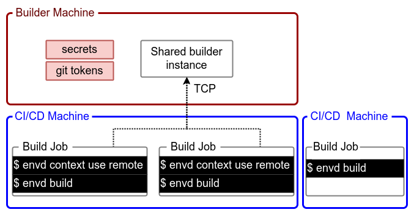

# `envd` Contexts

This guide shows how contexts make it easy for a single `envd` CLI to manage multiple builder instances. You can also use `envd` to build the images in CI/CD systems with the help of `envd` contexts.

A single `envd` CLI can have multiple contexts. Each context contains the endpoint and security information required to manage different builder instances. A builder instance is responsible for building images and storing the building cache. A builder instance runs a separate [buildkit daemon](https://github.com/moby/buildkit).

The docker context command makes it easy to configure these contexts and switch between them.

## The anatomy of a context

There are the properties of a context:

- `name`: name of the context
- `builder`: type of the builder instance (`docker-container`, `kube-pod`, `tcp`)
- `builder-addr`: builder instance endpoint
- `runner`: type of the runner instance (`docker`, `envd-server`)
- `runner-addr`: runner instance endpoint

Viewing the default context is the easiest way to see what a context looks like.

```bash
$ envd context ls
CONTEXT                 BUILDER                 BUILDER ADDR                            
default (current)       docker-container        docker-container://envd_buildkitd
```

This shows the default context. `envd` bootstraps a builder container instance `envd_buildkitd` in Docker, and uses it to execute all `envd` commands.

The `builder` is used to build envd images. And the `runner` is to run envd environments. There are two types of `runner`: `docker` and `envd-server`. `envd-server` is an experimental runner to [run envd environments on Kubernetes](./kubernetes.md).

## Create a new context

A new context can be created with the `envd context create` command.

```bash
$ envd context create --name demo \
    --builder-address buildkitd-demo --use --builder docker-container \
    --runner docker
INFO[2022-08-15T15:33:24+08:00] Context demo is created                      
INFO[2022-08-15T15:33:24+08:00] Current context is now "demo"       
```

The argument `--use` switches to the newly created context. Then all the commands issued by `envd` will run in the new context.

Or you can use `envd context use` command to switch between the existing contexts.

## Remove a context

A context can be removed with the `envd context rm` command.

```bash
$ envd context rm --name demo
```

## Remote build (Advanced)

The builder instance `buildktid` can be run on a remote machine. There are some benefits:

- **No need to install Docker**: You don't need to install Docker on CI/CD machines or the remote builder machines.
- **Faster build**: The cache can be shared in different builds, Thus it will be faster to get the envd images.
- **Safer deployment**: The secret keys and tokens are stored in the builder machine. Programs in CI/CD builds cannot access them.



### Start remote buildkitd on builder machine

Before you run `envd` remote build, please start the buildkitd and expose it as a TCP service on the remote machine. You can have a look at the [buildkitd docs](https://github.com/moby/buildkit/blob/master/README.md#expose-buildkit-as-a-tcp-service) for more details.

```bash
$ buildkitd \
  --addr tcp://0.0.0.0:8888
  ...
```

The process should be long-running on the machine. All builds use this service.

::: tip
By default, buildkitd will set the cache limit size to 10% of your disk space. It will trigger the garbage collection after exceeding this limit. You can customize this by modifying the `worker.oci.gckeepstorage` or `worker.containerd.gckeepstorage` in the `buildkitd.toml` file. For more information, check the [buildkit config](https://github.com/moby/buildkit/blob/master/docs/buildkitd.toml.md).
:::

### Create `envd` context in build job

Then, let's create the corresponding `envd` context in the build job.

```bash
$ envd context create --name remote-context \
  --builder tcp \
  --builder-address <remote-machine-ip>:8888 \
  --use
```

### Build and push the image in build job

Then you can build and push the image in the build job.

```bash
$ envd build --output type=image,name=docker.io/<username>/<image>,push=true
```
