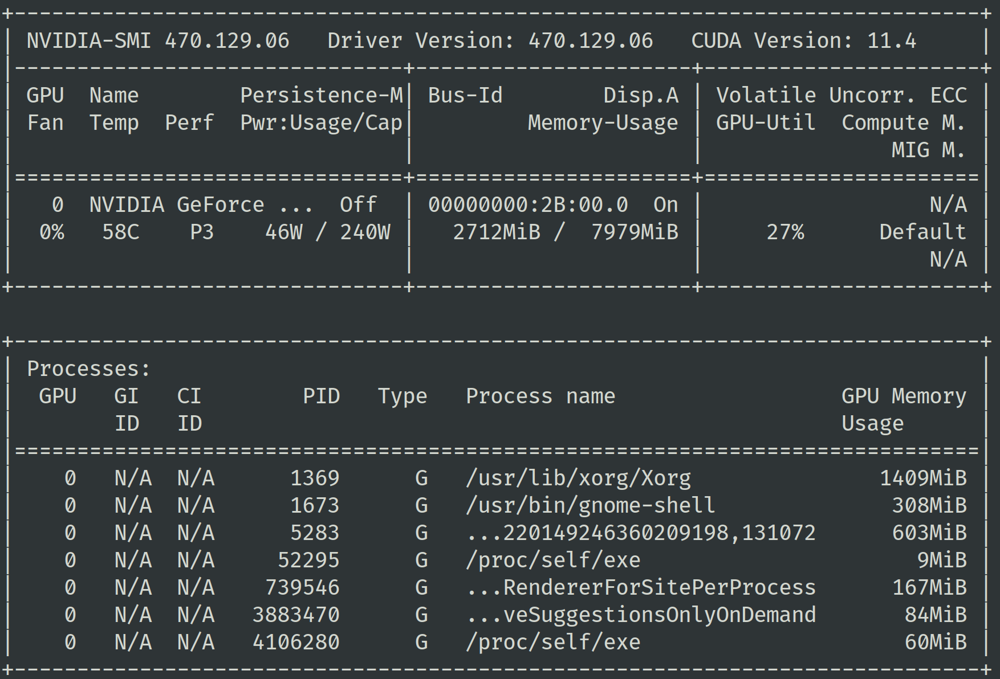
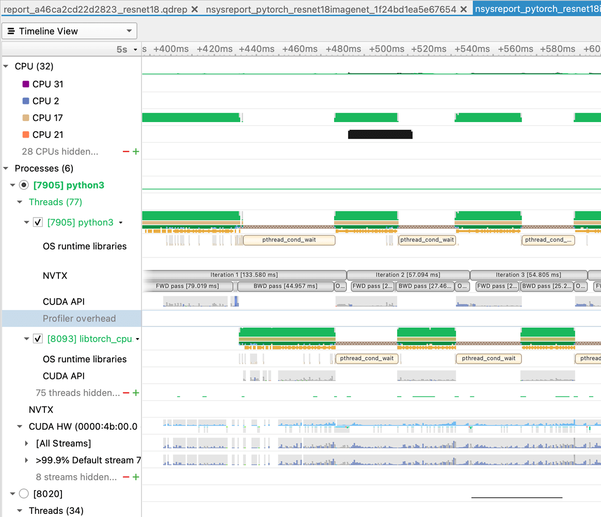
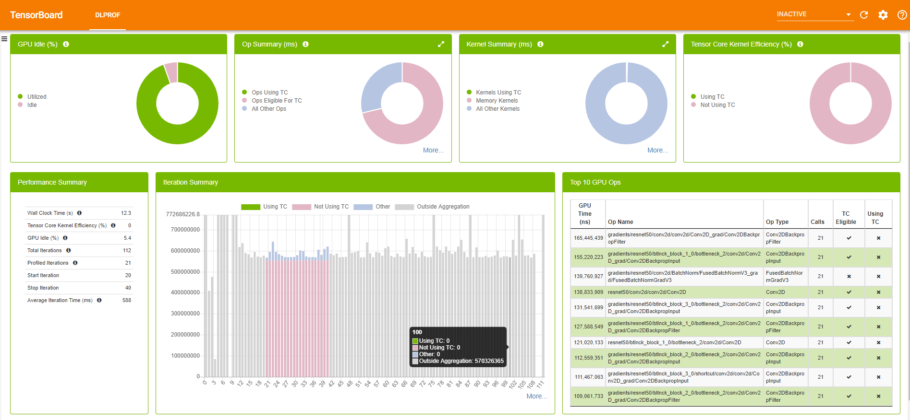

# 如何更好地 Profile 深度学习训练？

> TL; DR
> 为了能够更好地支持训练指标收集和任务的性能 profiling，我们设计了一个小规模的调查 [机器学习开发可观测性小调查](https://wenjuan.feishu.cn/m?t=s37flrIUVpFi-qsib)，我们希望在 [envd](https://envd.tensorchord.ai/) 中支持更符合算法工程师使用需求的 profiler 功能。欢迎参与！

深度学习训练是少见的，既可能是计算密集（Compute intensive），又可能是数据密集（Data intensive），还可能是内存密集（Memory intensive）型的工作负载。

这使得它的 profiling 过程非常复杂。当模型使用了超出预期的显存或者是内存，亦或是模型训练发挥不出显卡的计算能力等问题出现时，我们很难搞清楚到底发生了什么。当然，为了解决这些问题，也有一些开源的产品或者工具出现。

## TensorBoard

这其中最受欢迎的无疑是 [TensorBoard](https://www.tensorflow.org/tensorboard/get_started)。它能够帮助用户收集训练过程中的指标，进而对其进行可视化。其使用方式也非常简单：

```python
log_dir="logs/profile/" + datetime.now().strftime("%Y%m%d-%H%M%S")

tensorboard_callback = tf.keras.callbacks.TensorBoard(
    log_dir=log_dir, histogram_freq=1, profile_batch = 3)

model.fit(train_data,
          steps_per_epoch=20,
          epochs=5, 
          callbacks=[tensorboard_callback])
```

不仅 TensorFlow 和 Keras，PyTorch 也开始支持了 [TensorBoard](https://pytorch.org/docs/stable/tensorboard.html)。

## Nvidia SMI

如果你只是想获得一些硬件的指标，那么有更加简单的方式：`nvidia-smi`。你可以通过 `nvidia-smi` 命令查看不同进程的 GPU 显存使用情况。通常你会希望训练进程占用了绝大多数的可用显存，这说明你的模型正在很好地使用 GPU。



另外你可用关注其中的功耗（Power consumption）指标，当 GPU 的计算单元进行运算时，功耗会随之提升。一个高功耗意味着更高的计算单元使用频率。当你发现显存的使用很少，或者功耗很低时，可以尝试用更大的 batch size 进行训练。如果你希望获得更多的指标，可以通过 `nvidia-smi dmon` 命令来获得。

`nvidia-smi` 也是非常常用的性能调试工具，它提供 CLI 的接口，使用起来非常简单。

## Nvidia Nsight Systems

Nvidia Nsight Systems 是用来调试和优化 GPU 程序的有力工具。



TODO

## Nvidia DLProf

[DLProf](https://docs.nvidia.com/deeplearning/frameworks/dlprof-user-guide/) 是对 Nvidia Nsight 的一个封装。你可以通过 `dlprof python main.py` 来收集训练过程中的指标。它会生成两个文件：`sqlite` 和 `qdrep`，以及 `events_folder`。接下来可以使用 TensorBoard 来基于 `events_folder` 进行可视化展示。



## 如何选择

虽然有各种各样的工具可供选择，但是在我们看来，这些工具都比较难以使用。我们在之前的工作中也经常遇到与 GPU 相关的性能问题时头疼不已。


## 参考文献

- [Profiling and Optimizing Deep Neural Networks with DLProf and PyProf](https://developer.nvidia.com/blog/profiling-and-optimizing-deep-neural-networks-with-dlprof-and-pyprof/)

---

<Author/>
