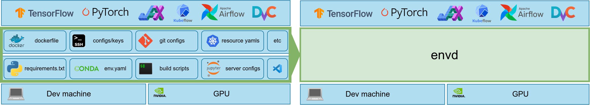

# 初识 envd

`envd` 是一个为算法工程师和数据科学家设计的**开发环境**管理工具。

🐍 **告别 Docker，All in Python** - 只需要使用 Python 描述构建过程，envd 帮助你解决复杂且容易出错的 Bash / Makefile / Dockerfile / ...

🖨️ **内置的 Jupyter/VSCode 支持** - 原生支持 Jupyter notebooks 和 VSCode remote 扩展，提供良好的开发体验。

⏱️ **节省时间** - 充分利用软件源和 Docker/Buildkit 的缓存机制，大大加快构建速度，节省构建时间。

☁️ **本地云端，无缝迁移** - `envd` 与 Docker 紧密结合，构建兼容 Docker 镜像标准的环境镜像，在本地云端都可以使用。

🔁 **可复现的构建和结果** - 完全复现相同的环境，无论是在你的笔记本电脑上，还是在数据中心，亦或是在公有云服务上。更好地复现训练结果。

## 为什么要使用 `envd`？

为了 AI/ML 应用配置开发环境，复现训练实验结果仍然是非常困难的事情。`envd` 是一个为数据科学和 AI/ML 场景设计的开发环境管理工具，使用 `envd` 构建的环境可以开箱即用地享受到这些优势：

🐍 **Life is short, use Python[^1]**

开发环境经常充满了 Dockerfiles, Bash 脚本，Kubernetes YAML 定义文件，和其他经常容易出现问题的复杂配置文件。`envd` 的构建是独立隔离且干净的，你只需要用 Python 以声明式的方式描述期望的行为，不再需要为 Bash / Makefile / Dockerfile / ... 不能工作而担心。



[^1]: 构建语言是 [starlark](https://docs.bazel.build/versions/main/skylark/language.html), 它是 Python 的一个简化的方言。

⏱️ **节省大量时间**

`envd` 利用了多个层次的缓存，来加速构建的过程。比如，PyPI 的软件包缓存会被不同的构建共享，因此在之前的构建中下载过的包会被缓存下来。后续再次构建就可以直接使用。这节省了大量的时间，尤其是当你在通过 trial and error 的方式调试更新开发环境时，效果更加显著。

<table>
<tr>
<td> envd </td> <td>

Docker[^2]

</td>
</tr>
<tr>
<td>

```diff
$ envd build
=> pip install tensorflow       5s
+ => Using cached tensorflow-...-.whl (511.7 MB)
```

</td>
<td>

```diff
$ docker build
=> pip install tensorflow      278s
- => Downloading tensorflow-...-.whl (511.7 MB)
```

</td>
</tr>
</table>

[^2]: Docker without [buildkit](https://github.com/moby/buildkit)

☁️ **本地和云，都是原生**

`envd` 与 Docker 紧密集成，你可以在 Docker Hub 或者任何兼容 OCI 镜像标准的镜像制品仓库内，分享、版本化、或者发布 `envd` 的环境。`envd` 构建的环境也可以直接运行在 Docker 或者是 Kubernetes 上。

🔁 **可复现的构建和结果**

完全复现相同的环境，无论是在你的笔记本电脑上，还是在数据中心，亦或是在公有云服务上。更好地复现训练结果。因此你可以安全且放心地跟你的同事分享开发环境，而不再需要担心 `为什么你的代码到我这里跑不出结果？`

🖨️ **内置的 Jupyter/VSCode 支持**

`envd` 提供原生的 Jupyter notebooks 和 VSCode remote extension 支持，你无需牺牲任何的日常开发习惯和使用体验，就可以享受到 `envd` 带来的优势。

## 谁应该使用 `envd`？

我们专注于帮助算法工程师和数据科学家们更好的开发 AI/ML 模型，他们通常会受这些问题折磨：

- 使用 Python、CUDA、Docker、SSH 和其他的工具构建开发环境。你是不是有一份“祖传”的 Dockerfile 或者是 Makefile 来设置开发环境，但是它经常出现各种各样的问题？
- 更新环境。你是不是经常需要问团队中的基础设施或者是运维工程师，应该如何在他们提供的镜像中添加新的依赖？
- 管理环境和机器。你是不是经常忘记训练任务跑在了哪台机器上，因为你同时在训练多个项目的模型？

:::tip 跟我们交流

💬 非常欢迎一起聊聊你在开发、部署、管理 AI/ML 训练任务和环境过程中遇到的问题。

[**约一个时间聊聊！**](https://forms.gle/9HDBHX5Y3fzuDCDAA)

:::

|       Before envd        |       After envd        |
| :----------------------: | :---------------------: |
|  |  |

如果你有这些问题，接下来，让我们在 5 分钟的时间里来创建一个环境试试看！

## 安装

### 要求

- Docker (20.10.0 或者更高)

### 安装 `envd`

`envd` 可以使用 `pip` 来安装。在安装完成后，请运行 `envd bootstrap` 来完成安装后的配置。

```bash
pip install --pre envd
envd bootstrap
```

:::tip

你可以通过 `--dockerhub-mirror` 或者 `-m` 这一 flag 来配置 `envd` 使用的 Docker Hub 镜像：

<custom-title title="设置 Docker Hub 镜像">

```bash 
envd bootstrap --dockerhub-mirror https://docker.mirrors.sjtug.sjtu.edu.cn
```

</custom-title>

:::

## 创建一个 `envd` 环境

请 clone 这个仓库 [`envd-quick-start`](https://github.com/tensorchord/envd-quick-start):

```bash
git clone https://github.com/tensorchord/envd-quick-start.git
```

`envd` 的构建文件 `build.envd` 内容如下：

<custom-title title="build.envd">

```python 
def build():
    base(os="ubuntu20.04", language="python3")
    install.python_packages(name = [
        "numpy",
    ])
    shell("zsh")
```

</custom-title>

接下来，请运行下面的命令来启动开发环境：

```bash
cd envd-quick-start && envd up
```

```bash
$ cd envd-quick-start && envd up
[+] ⌚ parse build.envd and download/cache dependencies 2.8s ✅ (finished)
 => download oh-my-zsh                                                    2.8s
[+] 🐋 build envd environment 18.3s (25/25) ✅ (finished)
 => create apt source dir                                                 0.0s
 => local://cache-dir                                                     0.1s
 => => transferring cache-dir: 5.12MB                                     0.1s
...
 => pip install numpy                                                    13.0s
 => copy /oh-my-zsh /home/envd/.oh-my-zsh                                 0.1s
 => mkfile /home/envd/install.sh                                          0.0s
 => install oh-my-zsh                                                     0.1s
 => mkfile /home/envd/.zshrc                                              0.0s
 => install shell                                                         0.0s
 => install PyPI packages                                                 0.0s
 => merging all components into one                                       0.3s
 => => merging                                                            0.3s
 => mkfile /home/envd/.gitconfig                                          0.0s
 => exporting to oci image format                                         2.4s
 => => exporting layers                                                   2.0s
 => => exporting manifest sha256:7dbe9494d2a7a39af16d514b997a5a8f08b637f  0.0s
 => => exporting config sha256:1da06b907d53cf8a7312c138c3221e590dedc2717  0.0s
 => => sending tarball                                                    0.4s
(envd) ➜  demo git:(master) ✗ # You are in the container-based environment!
```

## 设置 Jupyter notebooks

请在 `build.envd` 中添加 `config.jupyter` 来启用 Jupyter notebooks。

<custom-title>

```python 
def build():
    base(os="ubuntu20.04", language="python3")
    install.python_packages(name = [
        "numpy",
    ])
    shell("zsh")
    config.jupyter(password="")
```

</custom-title>

当你修改了 `build.envd` 后，不要忘记重建 `envd` 环境。

```bash
$ envd destroy
INFO[2022-06-19T23:12:03+08:00] envd-quick-start is destroyed
```

你可以通过 `envd get envs` 来得到环境中的 Jupyter notebook 的访问地址。

```bash
$ envd up --detach
$ envd get env
NAME                    JUPYTER                 SSH TARGET              CONTEXT                                 IMAGE                   GPU     CUDA    CUDNN   STATUS          CONTAINER ID
envd-quick-start        http://localhost:48484   envd-quick-start.envd   /home/gaocegege/code/envd-quick-start   envd-quick-start:dev    false   <none>  <none>  Up 54 seconds   bd3f6a729e94
```

## 社区

我们非常欢迎各种形式的贡献！

**问题:** 加入我们的 [discord 社区](https://discord.gg/KqswhpVgdU) 或者 [在 GitHub 上提 Issue](https://github.com/tensorchord/envd/issues)!

**贡献:** 请查阅我们的 [guides](https://github.com/tensorchord/envd/blob/main/CONTRIBUTING.md)。
