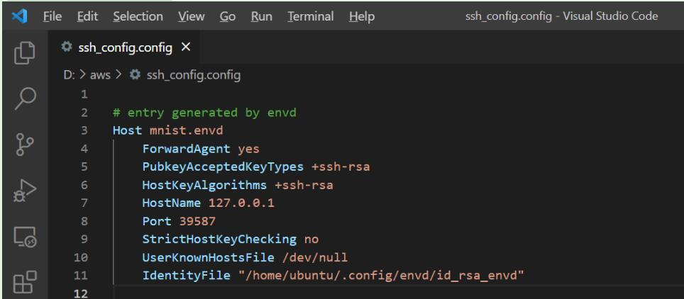
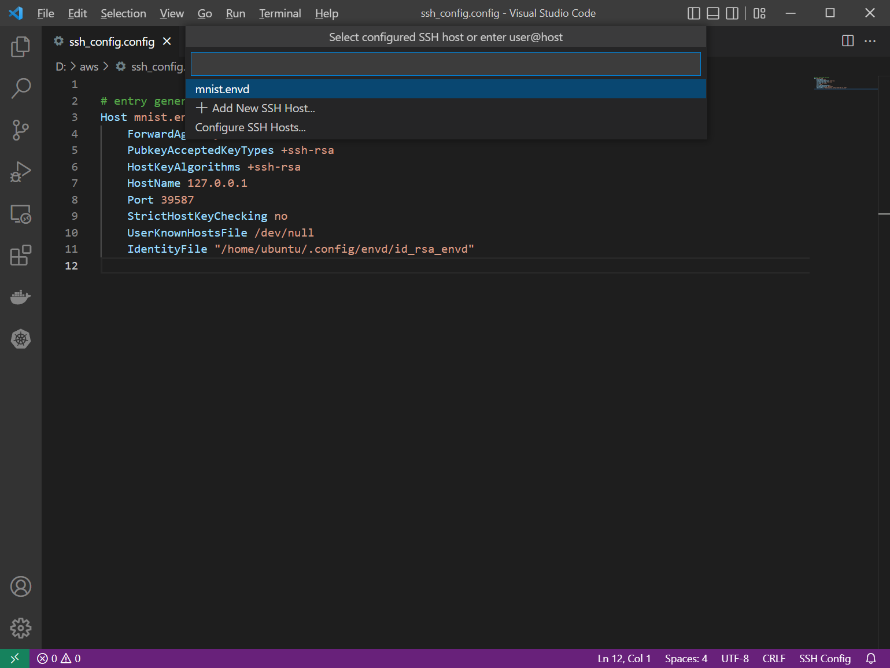
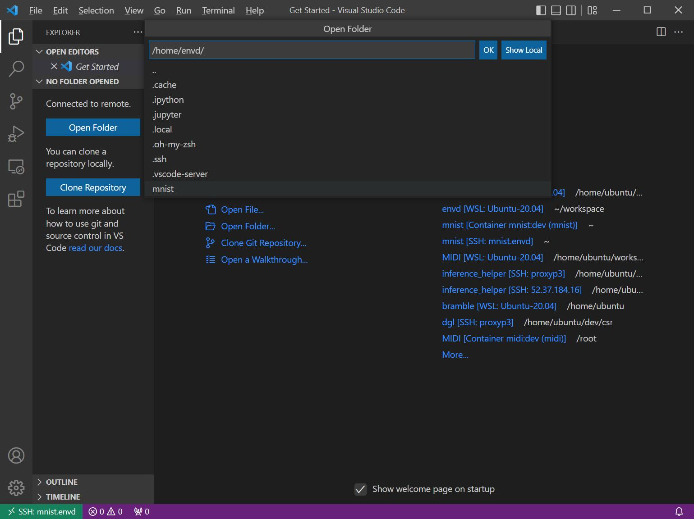
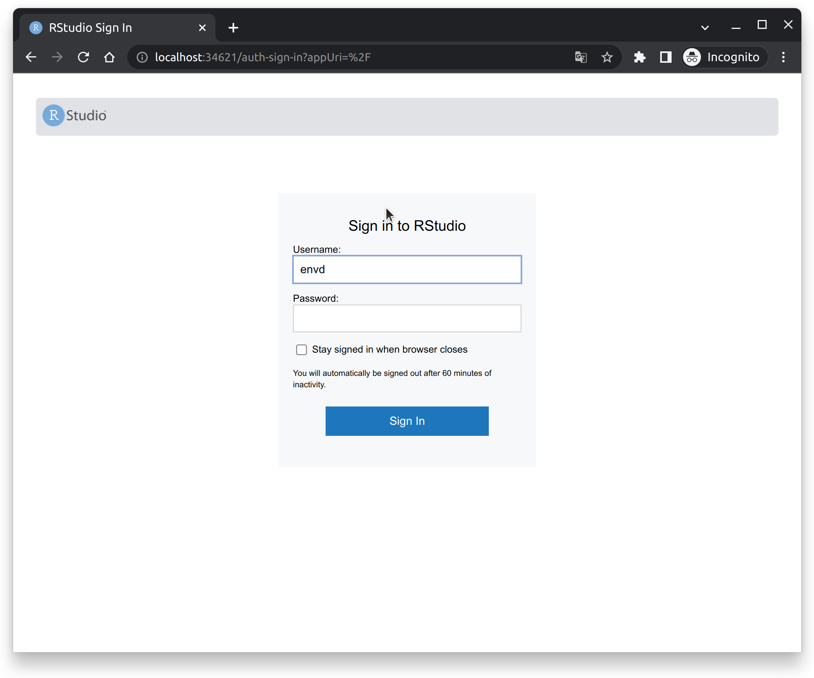

# 连接 `envd` 环境

演示项目地址：[envd/examples/mnist](https://github.com/tensorchord/envd/tree/main/examples/mnist)

## 构建并检查你的环境

通过 [构建 `envd` 环境](./build-envd) 的教程，您已经能够成功构建项目环境。在本章节中，我们将使用 `mnist` 项目来演示后续操作。构建成功后，您可以使用 `envd envs list` 命令来检查环境状态。

```
$ envd envs list
NAME    JUPYTER                 SSH TARGET      CONTEXT                                         IMAGE           GPU     CUDA    CUDNN   STATUS          CONTAINER ID
mnist   http://localhost:48484   mnist.envd      /home/ubuntu/workspace/envd/examples/mnist      mnist:dev       false   <none>  <none>  Up 2 hours      f3452559ee20
```

:::tip 小提示

`envd` 将在您的 ssh config 文件中添加新的 ssh 配置，以帮助您连接到 `envd` 环境。配置名称为：`<project_name>.envd`。



:::

## 使用 VSCode 连接到环境

1. 首先，您需要在 VSCode 中安装 [Remote - SSH](https://marketplace.visualstudio.com/items?itemName=ms-vscode-remote.remote-ssh) 扩展。您也可以点击访问 `vscode:extension/ms-vscode-remote.remote-ssh` 来安装该扩展。
2. 扩展安装成功后，点击左下角的 Open a Remote Window 图标，将看到如下用户界面。


3. 点击 `Connect to Host` 选项，选择您要连接的环境。



4. 选择目标后，打开以您的项目名称命名的文件夹（这里我们使用 mnist）。



最后，您成功使用 VSCode 连接到环境！


## 使用 Jupyter Notebook 连接到环境

在 `build.envd` 配置文件中，我们已经声明了 Jupyter 环境，并且密码为空。

<custom-title title="build.envd">

```python 
def build():
    ...
    config.jupyter()
```

</custom-title>

您也可以使用 `envd envs list` 命令获得 Jupyter 的端口信息。

```bash
$ envd envs list
NAME    JUPYTER                 SSH TARGET      CONTEXT                                         IMAGE           GPU     CUDA    CUDNN   STATUS          CONTAINER ID
mnist   http://localhost:48737   mnist.envd      /home/ubuntu/workspace/envd/examples/mnist      mnist:dev       false   <none>  <none>  Up 2 hours      f3452559ee20
```

在浏览器中输入 `http://localhost:48737` 访问您的 Jupyter Notebook。


## 使用 RStudio 连接到环境

你可以通过 `config.rstudio_server` 启用 [RStudio server](https://www.rstudio.com/products/rstudio/download-server/)。

<custom-title title="build.envd">

```python
def build():
    ...
    config.rstudio_server()
```

</custom-title>

RStudio 的地址可以通过 `envd envs list` 命令得到。

```
$ envd envs list
NAME    ENDPOINT                        SSH TARGET      IMAGE           GPU     CUDA    CUDNN   STATUS          CONTAINER ID 
r-basic rstudio: http://localhost:34621 r-basic.envd    r-basic:dev     false   <none>  <none>  Up 6 hours      1eb7d40e5a8a
```

接下来你可以通过 `http://localhost:34621` 在浏览器中使用 RStudio！请使用 `envd` 作为用户名，密码可以为任意字符串。




