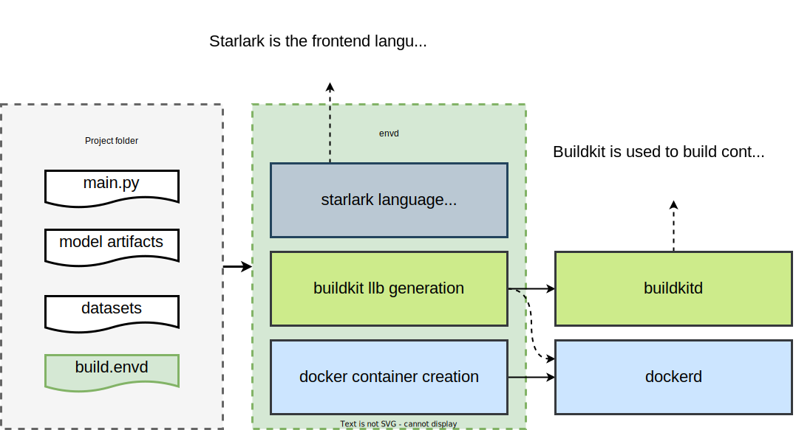

# 开发教程

首先感谢你愿意为`envd`添砖加瓦 🌟! 

我们的社区欢迎各种形式的贡献并且希望能尽我们所能地去拓展“贡献者”这个词的含义。我们的[贡献指南](./contributing)包含一些可以参与到项目其中的其他方式。如果你想向项目贡献代码，下面包含一些基础的步骤。

## 代码库结构

`envd`的源代码托管在[github.com/tensorchord/envd](https://github.com/tensorchord/envd)。除此之外，项目文档的源代码托管在[github.com/tensorchord/envd-docs](https://github.com/tensorchord/envd-docs)。

项目的代码库中有很多文件，下面是一个简短的概括。这些文件（夹）看起来很难懂，但你不需要了解代码库每一个文件的作用。我们推荐先从一个模块开始学习（比如，在envd中添加一个新的函数），然后慢慢地去了解其他部分。

- [📁 base-images/](https://github.com/tensorchord/envd/tree/main/base-images) 包含 Dockerfiles和envd基础镜像的建造脚本。
- [📁 cmd/](https://github.com/tensorchord/envd/tree/main/cmd) 包含 `envd` 和 `envd-ssh` 的命令行界面代码
    - [📁 envd/](https://github.com/tensorchord/envd/tree/main/cmd/envd) `envd` 的命令行界面
    - [📁 envd-ssh/](https://github.com/tensorchord/envd/tree/main/cmd/envd-ssh) `envd-ssh` 的命令行界面，envd用户不会直接使用它。它会注入到运行环境来射者sshd
- [📁 docs/](https://github.com/tensorchord/envd/tree/main/docs) 并不包含文档！它包含 `README.md` 中的提议和静态资源。项目文档托管在[github.com/tensorchord/envd-docs](https://github.com/tensorchord/envd-docs)。
- [📁 envd/](https://github.com/tensorchord/envd/tree/main/envd) 包含一个用来生成API引用的假python包。你只需要在对envd API做出修改时才需要对这个部分做出改动。
- [📁 examples/](https://github.com/tensorchord/envd/tree/main/examples) 包含envd的一些示例代码。
- [📁 pkg/](https://github.com/tensorchord/envd/tree/main/pkg) 包含envd命令行界面的代码实现。
    - [📁 app/](https://github.com/tensorchord/envd/tree/main/pkg/app) 包含命令行界面的配置。
    - [📁 autocomplete/](https://github.com/tensorchord/envd/tree/main/pkg/autocomplete) 包含bash和zsh的自动补全代码。
    - [📁 builder/](https://github.com/tensorchord/envd/tree/main/pkg/builder) 包含buildkit的建造器，它是项目中非常重要的一个部分。建造器会将starlark编译成[buildkit LLB](https://github.com/moby/buildkit#exploring-llb)，然后再构造镜像。
    - [📁 buildkitd/](https://github.com/tensorchord/envd/tree/main/pkg/buildkitd) 包含连接buildkitd容器的客户端代码。
    - [📁 config/](https://github.com/tensorchord/envd/tree/main/pkg/config) 包含envd的配置文件。
    - [📁 docker/](https://github.com/tensorchord/envd/tree/main/pkg/docker) 包含使用docker进程的客户端代码。
    - [📁 editor/](https://github.com/tensorchord/envd/tree/main/pkg/editor) 包含vscode和jupyter相关的代码实现。
    - [📁 envd/](https://github.com/tensorchord/envd/tree/main/pkg/envd) 包含envd引擎代码，它是一个用来管理envd环境的抽象层。
    - [📁 flag/](https://github.com/tensorchord/envd/tree/main/pkg/flag) 包含[viper](https://github.com/spf13/viper)的flags信息。
    - [📁 home/](https://github.com/tensorchord/envd/tree/main/pkg/home) 包含用来管理[XDG directories](https://specifications.freedesktop.org/basedir-spec/basedir-spec-latest.html)的代码 (比如 `$HOME/.config/envd` 和 `$HOME/.cache/envd`).
    - [📁 lang/](https://github.com/tensorchord/envd/tree/main/pkg/lang) 包含建造语言代码。如果你想往envd加入新函数，那么你需要更新该部分。
    - [📁 progress/](https://github.com/tensorchord/envd/tree/main/pkg/progress) 包含建造进展的输出代码。大部分情况你都不需要修改它。
    - [📁 remote/](https://github.com/tensorchord/envd/tree/main/pkg/remote) 包含sshd的代码实现。大部分情况你都不需要修改它。
    - [📁 shell/](https://github.com/tensorchord/envd/tree/main/pkg/shell) 包含zsh相关的代码。
    - [📁 ssh/](https://github.com/tensorchord/envd/tree/main/pkg/ssh) 包含一个ssh客户端，在执行 `envd up` 时它负责连接到运行容器。
    - [📁 types/](https://github.com/tensorchord/envd/tree/main/pkg/types) 定义了一些在[📁 pkg/envd](https://github.com/tensorchord/envd/tree/main/pkg/envd)用到的类型。

## 开发流程

下面的这些步骤会带你熟悉如何初始的设置步骤和开发流程。如果你有任何疑问，你可以在[discord](https://discord.gg/KqswhpVgdU)上问，或者在issues板块中描述你有疑问的步骤，我们会尽力帮助你解决问题。

1. Install [Docker](https://www.docker.com/products/docker-desktop/) (20.10.0 or above) and [Golang](https://go.dev/dl/) (1.18 or above).
1. [Fork](https://help.github.com/articles/fork-a-repo) the [envd repository](https://github.com/tensorchord/envd) into your own GitHub account.
1. Clone your new fork of the repository from GitHub onto your local computer.
    ```
    $ git clone https://github.com/YOUR_USERNAME/envd.git
    ```
1. Install the dependencies and compile envd.
    ```
    $ go mod tidy
    $ make
    $ ./bin/envd bootstrap
    $ ./bin/envd --version
    ```
1. Make some changes locally to the codebase and commit them with Git.
    ```
    $ git add -u
    $ git commit -m "YOUR COMMIT MESSAGE"
    ```
1. [Push](https://help.github.com/articles/github-glossary/#push) your new changes to your fork on GitHub.
    ```
    $ git push
    ```

### Lint

You could run the command below

```
make lint
```

You should see output similar to the following if there is any linting issue:

```
cmd/envd/main.go:36:67: Revision not declared by package version (typecheck)
                fmt.Println(c.App.Name, version.Package, c.App.Version, version.Revision)
                                                                                ^
make: *** [Makefile:102: lint] Error 1
```

### Running tests

To run tests you can issue

```
make test
```

## `envd up` from a developer's perspective

`envd` interprets all statements in `build.envd` and executes `build()`. The function calls such as [`install.python_packages`](../api/install#python_packages) and [`config.jupyter`](../api/config#jupyter) register information to envd's in-memory static graph. Then `envd` constructs the [buildkit LLB DAG graph](https://github.com/moby/buildkit#exploring-llb) according to the information and uses it to build resulting image.



## GitHub Issue Flow

- Issues tagged as [`good first issue 💖`](https://github.com/tensorchord/envd/issues?q=is%3Aissue+is%3Aopen+label%3A%22good+first+issue+%E2%9D%A4%EF%B8%8F%22) are a good place to get started. 
- If you'd like to start working on an existing issue, comment on the issue that you plan to work on it so other contributors know it's being handled and can offer help.
